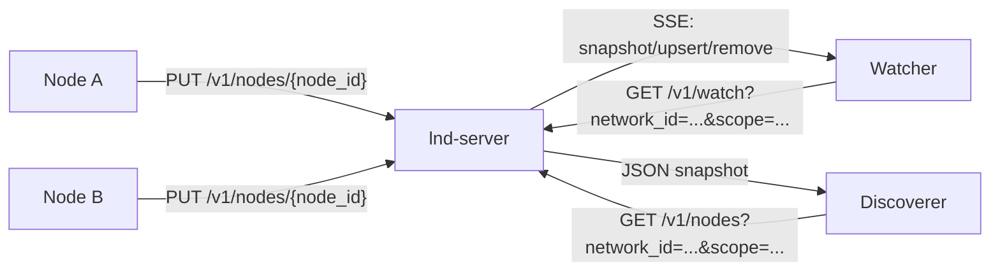

# Local Network Discover

`lnd` 是一个基于 HTTP(S) 中心注册表的局域网发现库与应用. 它不依赖组播广播, 而是让节点主动向中心 server 注册租约, 再由 server 负责查询和实时事件分发. 目标是提供比 mDNS 更稳定, 更可控, 也更容易跨子网和容器环境部署的发现能力.

仓库同时产出三类内容:

- Rust library: `rlib + cdylib`
- 客户端二进制: `lnd-client`
- 服务端二进制: `lnd-server`

v1 协议为 REST + SSE:

- `PUT /v1/nodes/{node_id}`: 注册或续租
- `GET /v1/nodes`: 一次性查询
- `GET /v1/watch`: SSE 持续监听
- `GET /healthz`: 健康检查

## 特性

- 中心化租约注册表, 避免 mDNS 在复杂网络环境中的组播不稳定问题
- 基于 `network_id + service + tags + reachability_scopes overlap` 的发现过滤
- `network_id` 可选, 用于逻辑隔离
- `reachability_scopes` 自动基于本机子网前缀收集, 用于多网卡和多子网可达性重叠匹配
- 客户端带抖动续租, 指数退避重连, SSE 断线重连和 cursor 恢复
- 默认自动收集非 loopback 的私网 IPv4, 也支持 loopback, IPv6, 接口白名单和黑名单
- Rust API 采用 builder 和 handle 风格, 便于嵌入其他项目
- 导出稳定 C ABI 作为底座, 并在仓库内提供面向外部语言的高层 SDK
- Server 可以独立运行, 也可以通过 `build_router` 嵌入自己的 Axum 服务

## 整体流程

1. 节点启动 client, 构造 `AnnounceSpec`
2. client 解析本机可上报的 LAN 地址, 或使用显式配置地址
3. client 调用 `PUT /v1/nodes/{node_id}` 注册当前租约
4. client 按 `ttl_secs / 3` 周期续租, 并加入随机抖动
5. server 在内存中维护节点表和事件环形缓冲, 为每次变更分配递增 revision
6. 其他 client 通过 `GET /v1/nodes` 查询当前快照, 或通过 `GET /v1/watch` 订阅 `snapshot/upsert/remove/reset/keepalive`
7. 默认查询会携带本机 `reachability_scopes`, server 返回与查询方 scope 有交集的节点
8. 如果节点停止续租, server 在租约到期后自动摘除, 并广播 `remove`
9. 如果 watch 端 cursor 太旧或 SSE lag 过大, server 返回 `reset`, client 自动拉全量快照重同步

可以把它理解为: 把 mDNS 的 "广播可见性" 改成 "中心 server 仲裁可见性".



## 数据模型

注册模型固定为:

```json
{
  "network_id": "office-a",
  "node_id": "b8bbf1c0-39f5-4598-a703-3b78fd9390ca",
  "service": "_demo._tcp",
  "display_name": "devbox-a",
  "port": 8080,
  "lan_addrs": ["192.168.1.10:8080"],
  "reachability_scopes": ["192.168.1.0/24"],
  "tags": ["stable", "blue"],
  "metadata": {
    "version": "1.0.0",
    "role": "api"
  },
  "ttl_secs": 30
}
```

查询结果在此基础上额外带上租约信息:

```json
{
  "network_id": "office-a",
  "node_id": "b8bbf1c0-39f5-4598-a703-3b78fd9390ca",
  "service": "_demo._tcp",
  "display_name": "devbox-a",
  "port": 8080,
  "lan_addrs": ["192.168.1.10:8080"],
  "reachability_scopes": ["192.168.1.0/24"],
  "tags": ["stable", "blue"],
  "metadata": {
    "version": "1.0.0"
  },
  "lease": {
    "revision": 7,
    "ttl_secs": 30,
    "expires_at_unix_ms": 1760000000000,
    "last_seen_unix_ms": 1759999990000
  }
}
```

## 默认值

- 默认 server 监听: `0.0.0.0:8765`
- 默认 client `base URL`: `http://127.0.0.1:8765`
- 默认 `ttl_secs`: `30`
- 默认续租间隔: `ttl / 3`
- 默认 SSE keepalive: `15s`
- 默认事件缓冲区: `4096`
- 默认地址选择:
  - `include_private_ipv4 = true`
  - `include_loopback = false`
  - `include_link_local_ipv4 = false`
  - `include_ipv6 = false`

## `network_id` 与 `reachability_scopes`

当前推荐模型是双层的:

- `network_id`: 可选逻辑发现域, 用于区分 `dev`, `staging`, `prod` 或不同租户
- `reachability_scopes`: 本机子网前缀列表, 用于自动可达性 overlap 匹配

`reachability_scopes` 的自动推导规则:

当前自动推导规则:

- IPv4 使用 `ip & netmask` 得到子网前缀, 例如 `192.168.1.0/24`
- IPv6 使用 `ip/prefixlen` 得到前缀, 例如 `fd12:3456:789a:1::/64`
- 再把前缀编码成稳定的 `lan-<hex>` 形式, 例如 `lan-ec3a7b1765ff30c6`

当前没有使用网关 MAC 作为默认标识策略. 原因是默认网关和邻居表的获取在不同平台上差异较大, 对容器和受限环境也不够稳定. 子网前缀指纹更容易在 Rust、Go、Python 和 C ABI 之间保持一致行为.

使用建议:

- 零配置场景: 只依赖 `reachability_scopes`
- 严肃部署: `network_id + reachability_scopes overlap`
- 多网卡场景: 保留自动 `reachability_scopes`, 必要时显式指定 `network_id`

可以先列出候选:

- Rust: `client.list_network_id_candidates()`
- Python: `client.list_network_id_candidates()`
- Go: `client.ListNetworkIDCandidates()`
- C ABI: `lnd_list_network_id_candidates_json()`

可达域候选:

- Rust: `client.list_reachability_scopes()`
- Python: `client.list_reachability_scopes()`
- Go: `client.ListReachabilityScopes()`

## 构建

```bash
cargo build --release
```

如果本机安装了 [`just`](https://github.com/casey/just), 也可以直接使用仓库根目录的 [justfile](/Users/azazo1/pjs/rust/lnd/justfile) 快速执行常用命令, 例如:

```bash
just server
just discover --service _demo._tcp --json
just python-wheel
```

构建完成后通常可以得到:

- `target/release/lnd-client`
- `target/release/lnd-server`
- `target/release/liblnd.so`
- `target/release/liblnd.dylib`
- `target/release/lnd.dll`
- `include/lnd.h`

动态库文件名由平台决定:

- Linux: `liblnd.so`
- macOS: `liblnd.dylib`
- Windows: `lnd.dll`

## 命令行工具

### 启动服务端

最简单的启动方式:

```bash
cargo run --bin lnd-server -- --listen-addr 0.0.0.0:8765 --bearer-token dev-token
```

也可以从 `config.toml` 读取基础配置, 然后再用 CLI 或环境变量覆盖:

```bash
cargo run --bin lnd-server -- --config config.toml.example
```

支持的环境变量:

- `LND_LISTEN_ADDR`
- `LND_BEARER_TOKEN`
- `LND_SSE_KEEPALIVE_SECS`
- `LND_EVENT_BUFFER_CAPACITY`

示例配置:

```toml
listen_addr = "0.0.0.0:8765"
bearer_token = "dev-token"
sse_keepalive_secs = 15
event_buffer_capacity = 4096
```

### 注册本机服务

`announce` 会先立即注册一次, 然后进入续租循环, 行为类似长期运行的 mDNS responder.

```bash
cargo run --bin lnd-client -- \
  --server-url http://127.0.0.1:8765 \
  --bearer-token dev-token \
  announce \
  --service _demo._tcp \
  --port 8080 \
  --display-name devbox-a \
  --tag stable \
  --tag blue \
  --metadata version=1.0.0 \
  --metadata role=api
```

如果希望自动推导 `network_id`:

```bash
cargo run --bin lnd-client -- \
  --server-url http://127.0.0.1:8765 \
  --bearer-token dev-token \
  announce \
  --auto-network-id \
  --auto-reachability-scopes \
  --service _demo._tcp \
  --port 8080 \
  --display-name devbox-a
```

常用参数:

- `--server-url`: client 连接的 server base URL
- `--bearer-token`: 预共享 Bearer token
- `--node-id`: 显式指定持久 node id
- `--node-id-path`: CLI 自己使用的状态文件路径, 用于读取或生成 node id
- `--lan-addr`: 手工指定地址, 可多次传入
- `--auto-lan-addrs`: 是否自动补充本机地址
- `--auto-reachability-scopes`: 是否自动补充本机子网可达域
- `--scope`: 显式追加可达域, 可多次传入
- `--include-loopback`: 是否允许自动发现到 loopback
- `--include-ipv6`: 是否允许自动发现到 IPv6
- `--enable-interface`: 自动选址接口白名单
- `--disable-interface`: 自动选址接口黑名单
- `--ttl-secs`: 租约 TTL

示例:

```bash
cargo run --bin lnd-client -- \
  --server-url http://127.0.0.1:8765 \
  --bearer-token dev-token \
  announce \
  --network-id office-a \
  --service _web._tcp \
  --port 3000 \
  --lan-addr 192.168.1.20 \
  --lan-addr 10.0.0.10:3000 \
  --auto-lan-addrs false \
  --include-loopback
```

### 一次性发现

```bash
cargo run --bin lnd-client -- \
  --server-url http://127.0.0.1:8765 \
  --bearer-token dev-token \
  discover \
  --network-id office-a \
  --auto-scope-overlap \
  --service _demo._tcp \
  --tag stable
```

或者使用自动推导:

```bash
cargo run --bin lnd-client -- \
  --server-url http://127.0.0.1:8765 \
  --bearer-token dev-token \
  discover \
  --auto-scope-overlap \
  --service _demo._tcp
```

结构化输出:

```bash
cargo run --bin lnd-client -- \
  --server-url http://127.0.0.1:8765 \
  --bearer-token dev-token \
  discover \
  --network-id office-a \
  --json
```

### 持续监听

```bash
cargo run --bin lnd-client -- \
  --server-url http://127.0.0.1:8765 \
  --bearer-token dev-token \
  watch \
  --auto-scope-overlap \
  --service _demo._tcp \
  --json
```

`watch` 输出的是 `DiscoveryEventEnvelope`, 其中 `event` 可能为:

- `snapshot`
- `upsert`
- `remove`
- `reset`
- `keepalive`

## Rust 库接入

### 作为 client 使用

依赖:

```toml
[dependencies]
lnd = { path = "../lnd" }
tokio = { version = "1", features = ["macros", "rt-multi-thread"] }
futures = "0.3"
```

注册和持续发现:

```rust
use futures::StreamExt;
use lnd::{AnnounceSpec, DiscoveryFilter, LndClient};

#[tokio::main]
async fn main() -> anyhow::Result<()> {
    let client = LndClient::builder("http://127.0.0.1:8765")
        .bearer_token("dev-token")
        .include_loopback(true)
        .build()?;

    let network_id = client.resolve_network_id()?;
    let scopes = client
        .list_reachability_scopes()?
        .into_iter()
        .map(|scope| scope.scope)
        .collect::<Vec<_>>();

    let spec = AnnounceSpec::new("node-a", "_demo._tcp", "devbox-a", 8080)
    .with_network_id(network_id.clone())
    .add_tag("stable")
    .insert_metadata("version", "1.0.0")
    .include_loopback(true);

    let _announce = client.announce_loop(spec)?;

    let nodes = client
        .list(
            DiscoveryFilter::new()
                .with_network_id(network_id)
                .with_service("_demo._tcp")
                .with_reachability_scopes(scopes.clone()),
        )
        .await?;
    println!("nodes = {}", nodes.len());

    let mut watch = client.watch(
        DiscoveryFilter::new()
            .with_service("_demo._tcp")
            .with_reachability_scopes(scopes),
    );
    while let Some(event) = watch.next().await {
        println!("{:?}", event?);
    }

    Ok(())
}
```

Rust 侧主要公开类型:

- `ClientConfig`
- `ClientBuilder`
- `LndClient`
- `AnnounceSpec`
- `AddressSelection`
- `DiscoveryFilter`
- `DiscoveredNode`
- `DiscoveryEvent`
- `LeaseInfo`
- `DerivedNetworkId`
- `ReachabilityScope`

Rust library 侧的 `node_id` 生成, 持久化, 以及 `display_name` 默认值由接入端自己决定.

与 `mdns-sd` 风格相近的点:

- 可长期持有的 client handle
- `new(...).with_*` 和 builder 风格配置
- 一次性查询和流式监听拆分明确
- 节点上报参数和地址选择参数可渐进构造

`AnnounceSpec` 常用 builder:

- `with_lan_addrs`
- `add_lan_addr`
- `with_auto_lan_addrs`
- `with_address_selection`
- `with_tags`
- `add_tag`
- `with_metadata`
- `insert_metadata`
- `with_ttl_secs`
- `include_loopback`
- `include_ipv6`
- `with_interface`
- `without_interface`

`AddressSelection` 常用 builder:

- `with_loopback`
- `with_private_ipv4`
- `with_link_local_ipv4`
- `with_ipv6`
- `with_interface`
- `without_interface`

自动 `network_id` 相关 API:

- `client.resolve_network_id()`
- `client.list_network_id_candidates()`
- `resolve_network_id_with_selection(&selection)`
- `list_network_id_candidates(&selection)`

自动 `reachability_scopes` 相关 API:

- `client.list_reachability_scopes()`
- `client.resolve_reachability_scopes(&spec)`
- `resolve_reachability_scopes_with_defaults(&spec, &selection)`

### 作为嵌入式 server 使用

如果你已经有自己的 Axum 服务, 可以直接复用路由和注册表:

```rust
use lnd::{InMemoryRegistry, ServerConfig, build_router};

#[tokio::main]
async fn main() -> anyhow::Result<()> {
    let config = ServerConfig::default();
    let registry = InMemoryRegistry::new(config.event_buffer_capacity);
    let app = build_router(config, registry);

    let listener = tokio::net::TcpListener::bind("0.0.0.0:8765").await?;
    axum::serve(listener, app).await?;
    Ok(())
}
```

如果你希望直接运行内置 server:

```rust
use lnd::{InMemoryRegistry, ServerConfig, run_server};

#[tokio::main]
async fn main() -> anyhow::Result<()> {
    let config = ServerConfig::default();
    let registry = InMemoryRegistry::new(config.event_buffer_capacity);
    run_server(config, registry).await?;
    Ok(())
}
```

## C ABI

v1 的跨语言底座仍然是 C ABI, 但它不是推荐给业务项目直接使用的最终接口. 推荐方式是:

- Rust 项目直接依赖 Rust crate
- Go 项目使用仓库内的纯 Go SDK
- Python 项目使用仓库内的高层 SDK
- 只有 C 或必须自己封装的场景, 才直接使用 `lnd.h`

设计原则是:

- Rust 内部复杂类型不直接跨 ABI 暴露
- 使用 opaque handle 管理 client, announce 和 watch 生命周期
- 请求和响应可以走 JSON
- 同时也提供 setter 风格 API, 让高层绑定可以映射出接近 Rust 原生的对象接口

头文件位于 [include/lnd.h](/Users/azazo1/pjs/rust/lnd/include/lnd.h). 它更适合作为绑定层的实现基础, 而不是应用层直接写业务时的 API.

### 核心对象

- `LndClientHandle`
- `LndFilterHandle`
- `LndAnnounceSpecHandle`
- `LndAnnounceHandle`
- `LndWatchHandle`

### 主要函数

client:

- `lnd_client_new`
- `lnd_client_new_default`
- `lnd_client_set_server_url`
- `lnd_client_set_bearer_token`
- `lnd_client_set_timeout_ms`
- `lnd_client_set_reconnect_backoff_ms`
- `lnd_client_set_include_loopback`
- `lnd_client_set_include_ipv6`
- `lnd_client_set_include_private_ipv4`
- `lnd_client_set_include_link_local_ipv4`
- `lnd_client_enable_interface`
- `lnd_client_disable_interface`

discover:

- `lnd_filter_new`
- `lnd_filter_set_service`
- `lnd_filter_set_network_id`
- `lnd_filter_add_tag`
- `lnd_filter_add_scope`
- `lnd_discover`
- `lnd_discover_json`
- `lnd_resolve_network_id`
- `lnd_list_network_id_candidates_json`

announce:

- `lnd_announce_spec_new`
- `lnd_announce_spec_set_network_id`
- `lnd_announce_spec_set_node_id`
- `lnd_announce_spec_set_service`
- `lnd_announce_spec_set_display_name`
- `lnd_announce_spec_set_port`
- `lnd_announce_spec_set_auto_lan_addrs`
- `lnd_announce_spec_set_auto_reachability_scopes`
- `lnd_announce_spec_add_lan_addr`
- `lnd_announce_spec_add_scope`
- `lnd_announce_spec_set_include_loopback`
- `lnd_announce_spec_set_include_ipv6`
- `lnd_announce_spec_set_include_private_ipv4`
- `lnd_announce_spec_set_include_link_local_ipv4`
- `lnd_announce_spec_enable_interface`
- `lnd_announce_spec_disable_interface`
- `lnd_announce_spec_add_tag`
- `lnd_announce_spec_insert_metadata`
- `lnd_announce_spec_set_ttl_secs`
- `lnd_resolve_announce_addrs_json`
- `lnd_announce_once`
- `lnd_announce_start_with_spec`
- `lnd_announce_start`
- `lnd_announce_stop`

watch:

- `lnd_watch_start_with_filter`
- `lnd_watch_start`
- `lnd_watch_stop`

错误和内存管理:

- `lnd_string_free`
- `lnd_last_error`

### C 最小示例

```c
#include <stdio.h>
#include "lnd.h"

static void on_event(const char *json, void *user_data) {
  (void) user_data;
  printf("event: %s\n", json);
}

int main(void) {
  struct LndClientHandle *client = lnd_client_new("http://127.0.0.1:8765", "dev-token");
  struct LndFilterHandle *filter = lnd_filter_new("office-a");
  lnd_filter_set_service(filter, "_demo._tcp");

  char *nodes = lnd_discover(client, filter);
  if (nodes == NULL) {
    fprintf(stderr, "discover failed: %s\n", lnd_last_error());
    return 1;
  }
  printf("nodes: %s\n", nodes);
  lnd_string_free(nodes);

  struct LndWatchHandle *watch = lnd_watch_start_with_filter(client, filter, on_event, NULL);
  if (watch == NULL) {
    fprintf(stderr, "watch failed: %s\n", lnd_last_error());
    return 1;
  }

  getchar();
  lnd_watch_stop(watch);
  lnd_filter_free(filter);
  lnd_client_free(client);
  return 0;
}
```

示例源码见 [bindings/c/discover_watch.c](/Users/azazo1/pjs/rust/lnd/bindings/c/discover_watch.c).

## 其他语言接入

仓库现在区分两层:

- 底层: `include/lnd.h` 和 `liblnd`
- 高层: `bindings/` 下的各语言 SDK

推荐优先使用高层 SDK. 它们对外暴露的不是一组零散的 C 函数, 而是与 Rust 类似的对象接口:

- `Client`
- `DiscoveryFilter`
- `AnnounceSpec`
- `AnnounceHandle`
- `WatchHandle`

### Python

Python wheel 项目入口位于 [bindings/python](/Users/azazo1/pjs/rust/lnd/bindings/python), 其中 Rust 原生扩展子 crate 位于 [bindings/python/native](/Users/azazo1/pjs/rust/lnd/bindings/python/native).

可以构建 wheel:

```bash
cd bindings/python
maturin build --release
```

生成的 wheel 是包含原生扩展的包, 例如:

```bash
pip install target/wheels/lnd_sdk-0.1.0-*.whl
```

设计上分成两层:

- 主 crate `lnd` 保持纯 Rust, 不引入 `pyo3`
- `bindings/python/native` 是 workspace 子 crate, 负责 `maturin + pyo3` 原生扩展

运行时直接使用 wheel 内置的 `lnd._native`.

因此现在的目标形态是:

- Python 用户安装 wheel 后默认不需要额外准备 `liblnd`
- `pyo3` 不会进入主 Rust crate
- Python wheel 由 `bindings/python` 作为 mixed project 入口构建
- 扩展模块按 `abi3-py310` 构建, 一个 wheel 可覆盖 Python 3.10 及以上版本

最小用法:

```python
from lnd import Client, DiscoveryFilter

with Client("http://127.0.0.1:8765", "dev-token") as client:
    network_id = client.resolve_network_id()
    nodes = client.discover_with_auto_scope_overlap(
        DiscoveryFilter().with_network_id(network_id).with_service("_demo._tcp").add_tag("stable")
    )
    print(nodes)
```

示例见 [examples/sdk/python/discover.py](/Users/azazo1/pjs/rust/lnd/examples/sdk/python/discover.py), 绑定源码见 [bindings/python/lnd/client.py](/Users/azazo1/pjs/rust/lnd/bindings/python/lnd/client.py), Rust 扩展入口见 [bindings/python/native/src/lib.rs](/Users/azazo1/pjs/rust/lnd/bindings/python/native/src/lib.rs).

### Go

Go 这边不再建议走 `cgo + lnd.h`. 仓库内提供的是纯 Go SDK, 位于 [impls/go](/Users/azazo1/pjs/rust/lnd/impls/go), 直接实现 `lnd` 的 HTTP(S) + REST + SSE 协议.

这意味着如果仓库地址和版本 tag 可见, 外部项目可以直接:

```bash
go get github.com/azazo1/lnd/impls/go
```

这也是比 `cgo` 更合理的分发方式, 因为:

- 不要求调用方本地安装 Rust 动态库
- 不要求配置 `CGO_CFLAGS` 和 `CGO_LDFLAGS`
- 更符合 Go 生态对 `go get` 和纯 Go module 的预期
- `announce` 也会在 client 侧解析自动 LAN 地址, 不是把未展开的 spec 直接发给 server

最小用法:

```go
client := lnd.NewClient("http://127.0.0.1:8765", "dev-token")
networkID, err := client.ResolveNetworkID()
if err != nil {
    log.Fatal(err)
}
scopes, err := client.ListReachabilityScopes()
if err != nil {
    log.Fatal(err)
}
filter := lnd.NewDiscoveryFilter().WithNetworkID(networkID).WithService("_demo._tcp").AddTag("stable")
for _, scope := range scopes {
    filter = filter.AddReachabilityScope(scope)
}
nodes, err := client.Discover(
    context.Background(),
    filter,
)
```

示例见 [examples/sdk/go/main.go](/Users/azazo1/pjs/rust/lnd/examples/sdk/go/main.go), SDK 源码见 [impls/go/client.go](/Users/azazo1/pjs/rust/lnd/impls/go/client.go).

### Java

Java 和 Android 这边当前推荐直接使用纯 Java 协议重实现, 位于 [impls/java](/Users/azazo1/pjs/rust/lnd/impls/java).

这样做的原因是:

- 不需要额外准备 Rust 动态库
- 不需要在 Android 上额外铺 `JNI + NDK + 多 ABI` 打包链路
- API 可以直接做成 Java/Kotlin 习惯的高层对象接口

当前 Java SDK 覆盖:

- `Client`
- `DiscoveryFilter`
- `AnnounceSpec`
- `AddressSelection`
- `AnnounceHandle`
- `WatchHandle`

以及这些能力:

- `resolveNetworkId()`
- `listNetworkIdCandidates()`
- `listReachabilityScopes()`
- `discover()`
- `discoverWithAutoScopeOverlap()`
- `announceOnce()`
- `announce()`
- `watch()`
- `watchWithAutoScopeOverlap()`

最小接入方式:

```java
Client client = new Client("http://127.0.0.1:8765", "dev-token");
String networkId = client.resolveNetworkId();
```

示例见 [examples/sdk/java/Main.java](/Users/azazo1/pjs/rust/lnd/examples/sdk/java/Main.java), SDK 源码见 [impls/java](/Users/azazo1/pjs/rust/lnd/impls/java).

如果只问 "Rust 能不能直接用于 Android", 答案是可以, 但当前仓库还没有这些内容:

- Android `NDK` 构建
- `JNI` 封装
- `AAR` 或 Android 示例工程

所以现在更推荐 Java 纯协议 SDK 这条路径.

### C Sharp

仓库中暂未放 C# 高层绑定. 如果后续要支持 .NET, 更合理的方向也是先做一层对象化封装, 而不是让业务代码直接写 `DllImport` 调裸 C ABI.

## examples

Rust 示例:

- [examples/embedded_server.rs](/Users/azazo1/pjs/rust/lnd/examples/embedded_server.rs): 嵌入式 Axum server
- [examples/announce_once.rs](/Users/azazo1/pjs/rust/lnd/examples/announce_once.rs): 一次性注册
- [examples/watch.rs](/Users/azazo1/pjs/rust/lnd/examples/watch.rs): 持续监听事件

SDK 示例:

- [examples/sdk/go/main.go](/Users/azazo1/pjs/rust/lnd/examples/sdk/go/main.go)
- [examples/sdk/java/Main.java](/Users/azazo1/pjs/rust/lnd/examples/sdk/java/Main.java)
- [examples/sdk/python/discover.py](/Users/azazo1/pjs/rust/lnd/examples/sdk/python/discover.py)

C ABI 示例:

- [bindings/c/discover_watch.c](/Users/azazo1/pjs/rust/lnd/bindings/c/discover_watch.c)

Bindings:

- [bindings/python](/Users/azazo1/pjs/rust/lnd/bindings/python)
- [impls/go](/Users/azazo1/pjs/rust/lnd/impls/go)
- [impls/java](/Users/azazo1/pjs/rust/lnd/impls/java)

## 设计取舍

- v1 只做单 server, 不做高可用和集群复制
- server 状态驻留内存, 重启后依赖 client 自动重新注册
- `network_id` 是可选逻辑发现域, 不代表网络可达性边界
- `reachability_scopes` 基于本机子网前缀, 用于自动可达性 overlap 匹配
- 自动 `network_id` 当前仍基于本机子网前缀指纹, 不基于网关 MAC
- v1 先只建模单端口和一组 LAN 地址, 不做多端点协议图
- C ABI 追求稳定和可包一层, 不直接暴露 Rust 内部泛型和异步类型

## 何时适合用 lnd

适合:

- 局域网服务发现需要跨 VLAN, 容器网络, 虚拟机网络
- 需要中心审计和统一可观测性
- 希望稳定地做服务上线, 下线和监听
- 需要让多种语言共享同一发现协议

不太适合:

- 完全离线且不能接受中心 server 的环境
- 必须零配置即插即用且不能部署任何注册中心

## 测试

```bash
cargo test
cargo clippy --all-targets --all-features
```

## 许可证

本项目使用 [MIT License](/Users/azazo1/pjs/rust/lnd/LICENSE).
